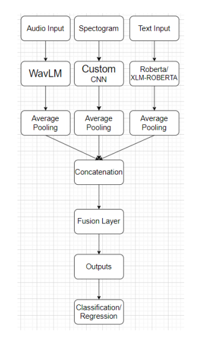

# VibeSpeaker

## 🎤 Speech Emotion Recognition (SER) using Multimodal Deep Learning

VibeSpeaker is a **multimodal Speech Emotion Recognition (SER) system** that integrates **audio, text, and spectrogram features** to accurately classify and analyze emotions in speech. The model leverages cutting-edge **deep learning architectures** like **WavLM, RoBERTa, and CNNs**, enabling real-time emotion recognition.

## 🚀 Features
- **Multimodal Learning**: Uses **audio features (WavLM)**, **text features (RoBERTa)**, and **visual features (spectrograms via CNNs)**.
- **Speech-to-Text Integration**: Employs **Whisper-large-v3-turbo** for real-time transcription.
- **Robust Preprocessing**: Normalization, resizing, and feature extraction from different modalities.
- **Emotion Classification & Regression**: Supports **8 emotion categories** and **continuous emotion prediction (valence, arousal, dominance)**.
- **Fine-tuned Transformer Models**: Optimized for improved performance on multilingual datasets.

## 🛠️ Technologies Used
- **Audio Processing**: [WavLM (microsoft/wavlm-base-plus)](https://huggingface.co/microsoft/wavlm-base-plus)
- **Text Processing**: [RoBERTa (roberta-base)](https://huggingface.co/roberta-base) & [XLM-RoBERTa](https://huggingface.co/xlm-roberta-base)
- **Visual Features**: CNN-based spectrogram analysis
- **Speech-to-Text**: [Whisper-large-v3-turbo](https://openai.com/research/whisper)
- **Optimization**: AdamW optimizer, learning rate scheduling, gradient accumulation

## 📂 Project Structure
```
VibeSpeaker/
├── src/
│   ├── dataset.py
│   ├── model.py
│   ├── demo.py
└── README.md
```

## 🖼️ Model Architecture


## 🔧 Installation & Usage
### 1️⃣ Clone the Repository
```sh
git clone https://github.com/your-username/VibeSpeaker.git
cd VibeSpeaker
```
### 2️⃣ Install Dependencies
```sh
pip install -r requirements.txt
```
### 3️⃣ Run Inference on an Audio File
```sh
python inference.py --audio_file sample.wav
```

## 🏆 Experimental Results
| Model       | Valence CCC | Arousal CCC | Dominance CCC | Accuracy |
|------------|------------|------------|--------------|----------|
| WavLM + RoBERTa + CNN  | **0.2809** | **0.3769** | **0.3249** | **95.95%** |
| WavLM + RoBERTa | 0.2754 | 0.3937 | 0.2947 | 86.64% |
| WavLM Only | 0.2354 | 0.3544 | 0.2183 | 54.66% |

### 📊 Performance Metrics


## ✍️ Authors
- [Vișan Ionuț](https://github.com/visan-ionut)
- [Poață Cătălin-Andrei](https://github.com/CatalinPoata)
- [Vulpe Ștefan](https://github.com/stefanvulpe-dev)

🎓 Developed as part of the **Artificial Intelligence Master, UNSTP Bucharest**.

## 📜 License
This project is licensed under the MIT License - see the [LICENSE](LICENSE) file for details.

---
Feel free to contribute, report issues, or share ideas for improvements! 🚀
